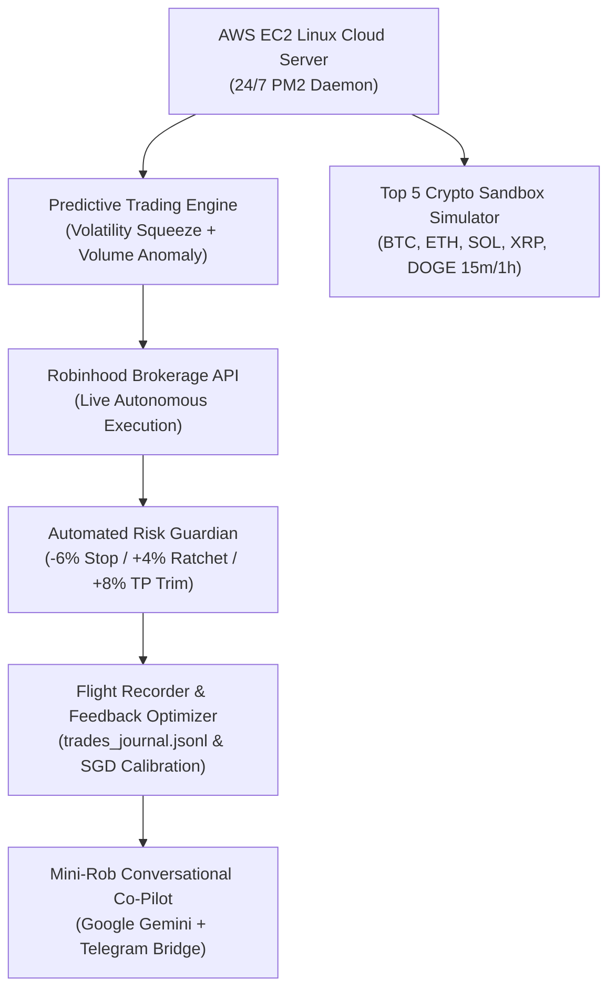

# 🚀 Autonomous Cloud Trading & Risk Guardian System

[](https://nodejs.org/)
[](https://aws.amazon.com/ec2/)
[](https://deepmind.google/)
[](https://opensource.org/licenses/MIT)

A production-grade, 24/7 autonomous quantitative trading infrastructure and portfolio risk guardian co-piloted with **Google Antigravity** (Google DeepMind's advanced agentic AI coding environment). Hosted on a headless **AWS EC2 Ubuntu Linux** instance, the system executes disciplined physical AI supply-chain investing, multi-factor breakout predictions, automated risk ratchets, and interactive Telegram control.

---

## 🏛️ System Architecture



---

## ✨ Key Capabilities

1. **🛡️ 24/7 Automated Risk Guardian:**
   - **+4% Breakeven Stop Ratchet:** Once an asset is up +4%, the stop-loss automatically moves to your entry price, locking in **$0 principal risk** ("playing with house money").
   - **+8% Take-Profit Harvest:** Automatically trims **50% of the position** upon hitting +8%, banking green cash while allowing runner shares to compound.
   - **-6% Hard Stop-Loss Floor:** Automatically liquidates 100% of the position if trade thesis is invalidated.

2. **🎯 Multi-Factor Pseudo-Neural Predictive Engine:**
   - **Volatility Squeeze Detection:** Identifies tight Bollinger Band compression inside Keltner/ATR channels before explosive expansion.
   - **Volume Anomaly Scoring:** Evaluates volume spikes against a 20-day rolling median baseline.
   - **Wilder 14-Day RSI & Trend Alignment:** Evaluates price position relative to 20-day and 50-day moving averages.
   - **Market Index Governor:** Prevents capital deployment when benchmark tech indexes (QQQ/SOXX) indicate risk-off regime.

3. **🧠 Recursive Self-Reflection & Online Feedback Optimizer:**
   - Logs every entry snapshot and exit event into a black-box flight recorder (`trades_journal.jsonl`).
   - Uses stochastic gradient descent (SGD) to continuously recalibrate feature weights based on empirical trade outcomes.

4. **🪙 Top 5 Crypto Quantitative Sandbox:**
   - Connects to public Coinbase exchange feeds to simulate the strategy on **BTC, ETH, SOL, XRP, and DOGE** across 15-minute and 1-hour intervals with zero real capital at risk.

5. **💬 Interactive Telegram Remote Terminal:**
   - Real-time portfolio summaries, dark-mode technical charts, breaking news sentiment analysis, and conversational order execution powered by Google Gemini.

---

## 🛠️ Quick Start & Setup

### Prerequisites
- Node.js v18.0 or higher
- An AWS EC2 Ubuntu instance (or any local/cloud Linux machine)
- A Telegram Bot Token (from [@BotFather](https://t.me/Botfather))
- Robinhood API / Bearer Token

### Installation

```bash
# 1. Clone the repository
git clone https://github.com/DB4407/robinhood-telegram-bot.git
cd robinhood-telegram-bot

# 2. Configure Environment Variables
cp .env.example .env
nano .env  # Enter your TELEGRAM_TOKEN, AUTHORIZED_USER_ID, and RH_ACCOUNT

# 3. Install dependencies
npm install

# 4. Launch with PM2 (24/7 daemon)
npm install -g pm2
pm2 start bot.js --name "trading-bot"
pm2 save
pm2 logs
```

---

## 🔒 Security & Safety Disclaimers

- **Zero Hardcoded Secrets:** All tokens, user IDs, and account numbers are strictly loaded via `.env` and excluded from version control.
- **Single-Tenant Whitelist:** The bot ignores messages from any Telegram user ID other than the configured `AUTHORIZED_USER_ID`.
- **Hard Circuit Breakers:** Maximum daily capital deployment and order sizing limits are strictly enforced in software.
- **Educational / Sandbox Use:** Trading stocks and cryptocurrencies carries financial risk. Always test strategies thoroughly in sandbox mode prior to deploying real capital.

---

## 🤝 Acknowledgements

Developed and architected collaboratively with **[Google Antigravity](https://deepmind.google/)** (Google DeepMind's advanced agentic AI programming environment), acting as autonomous quant co-pilot, systems engineer, and code architect.
