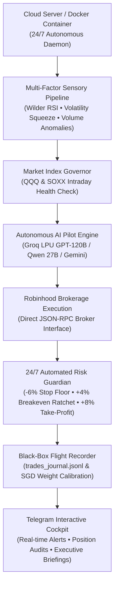

# 🚀 Autonomous Quantitative Trading Engine & Portfolio Guardian

[](https://nodejs.org/)
[](https://www.docker.com/)
[-success.svg)](package.json)
[](#-security--risk-architecture)
[](LICENSE)

A production-grade, 24/7 autonomous quantitative trading infrastructure and real-time risk guardian for **Robinhood**, operated remotely via an interactive **Telegram Cockpit**. 

The system combines an **Autonomous AI Pilot** (Groq LPU `openai/gpt-oss-120b` / `qwen/qwen3.6-27b` and Google Gemini), **multi-factor pseudo-neural breakout models**, and an **online stochastic gradient descent (SGD) self-optimizing feedback loop** that continuously learns from closed trade history.

Built with **zero external npm dependencies** using native Node.js, ensuring maximum portability, security, and instant deployment on Docker, AWS EC2, DigitalOcean, Linux, macOS, or Windows.

---

## 🏛️ System Architecture



---

## ✨ Core Features

### 1. 👨‍✈️ Autonomous AI Pilot & Opportunity Scout
* **Journal Memory & Active Learning:** Ingests the flight log (`trades_journal.jsonl`) to cite past winning setups and risk heuristics when deliberating new trades.
* **Autonomous Cash Reinvestment:** When spendable cash reaches threshold ($\ge \$10$), the AI Pilot evaluates candidate technicals, eliminates cash drag, and allocates capital with an institutional thesis and confidence score.
* **Daily Movers Catalyst Verification:** Evaluates surging Robinhood movers to separate genuine secular catalysts from dilution traps and reverse-split momentum.
* **Executive Mobile Briefings:** Tap **`👨‍✈️ AI Pilot Briefing`** anytime for an executive summary of portfolio health, macro status, and tactical directives.

### 2. ⚖️ Position Audit & High-Alpha Swaps
* **Opportunity Cost Analysis:** Evaluates every currently held position (`🚀 LEADER`, `⚖️ SOLID HOLD`, or `⚠️ LAGGARD / SWAP CANDIDATE`).
* **Capital Rotation:** Recommends swapping capital from stagnant holdings into high-conviction bottlenecks coiling in volatility squeezes.
* **1-Command Live Swaps:** Text `swap <FROM> to <TO>` (e.g. `swap WMT to VRT`) to immediately liquidate the laggard and recycle proceeds into the high-alpha leader.
* **Options & Asymmetric Leverage:** Evaluates near-the-money Call option viability versus fractional equity accumulation (theta decay vs asymmetric breakout odds).

### 3. 🛡️ 24/7 Automated Risk Guardian
* **Automated Breakeven Stop Ratchet (+4% Gain):** Once an open position reaches **+4.0% profit**, the stop loss is automatically moved up to your exact entry price, locking in **$0 principal risk** ("playing with house money").
* **Automated Take-Profit Harvest (+8% Gain):** Automatically sells **50% of the position** upon hitting +8.0% to bank green profits while allowing runner shares to compound.
* **Hard Stop-Loss Floor (-6% Loss):** Automatically liquidates 100% of the position if a setup deteriorates to prevent catastrophic drawdowns.

### 4. 🎯 Multi-Factor Pseudo-Neural Predictive Engine
* **Volatility Squeeze Detection:** Detects Bollinger Bands contracting inside Keltner/ATR channels before explosive breakout rallies.
* **Volume Anomaly Scoring:** Measures volume surges as a Z-score relative to a 20-day rolling median baseline.
* **14-Day Wilder RSI & Trend Momentum:** Filters out overbought tops (RSI > 68) and identifies dip entries.
* **Market Index Governor:** Restricts new buying when benchmark tech indexes (`QQQ` / `SOXX`) indicate intraday panic selling.

### 5. 🧠 Online Feedback Optimizer (SGD)
* Every trade entry snapshot and exit event is recorded into `data/trades_journal.jsonl`.
* Online stochastic gradient descent dynamically recalibrates multi-factor weights in `data/model_weights.json` based on real performance.

---

## 🔒 Security & Risk Architecture

* **Strict Single-Tenant Authorization:** Only the Telegram user ID specified in `AUTHORIZED_USER_ID` can view data or trigger commands. All other users are blocked.
* **Zero Hardcoded Secrets:** Tokens, account numbers, and API keys are strictly loaded via `.env` and excluded from git version control.
* **Localhost-Bound Health Server:** The internal HTTP healthcheck binds exclusively to `127.0.0.1:10000`, preventing external port scanning.
* **Hardware Circuit Breakers:** Maximum order sizes and daily deployment caps are strictly enforced in software (`config/trading_config.json`).

---

## 🚀 Quick Start & Deployment

### Prerequisites
* **Node.js v18.0+** (or **Docker**)
* **Telegram Bot Token:** Free from [@BotFather](https://t.me/BotFather)
* **Telegram User ID:** Free from [@userinfobot](https://t.me/userinfobot)
* **Robinhood Account Token:** Your Robinhood bearer or MCP API token
* **Groq API Key (Recommended):** Free from [console.groq.com](https://console.groq.com)

---

### Option A: Deploy with Docker (Recommended)

1. **Clone the repository:**
   ```bash
   git clone https://github.com/DB4407/robinhood-telegram-bot.git
   cd robinhood-telegram-bot
   ```

2. **Configure environment:**
   ```bash
   cp .env.example .env
   nano .env  # Fill in your credentials
   ```

3. **Launch the container:**
   ```bash
   docker compose up -d
   ```

4. **View live logs:**
   ```bash
   docker compose logs -f
   ```

---

### Option B: Deploy with PM2 on Ubuntu / Cloud VPS

1. **Clone the repository:**
   ```bash
   git clone https://github.com/DB4407/robinhood-telegram-bot.git
   cd robinhood-telegram-bot
   ```

2. **Configure environment:**
   ```bash
   cp .env.example .env
   nano .env
   ```

3. **Install PM2 & Launch:**
   ```bash
   npm install -g pm2
   pm2 start bot.js --name "trading-bot"
   pm2 save
   pm2 startup
   ```

4. **Monitor live logs:**
   ```bash
   pm2 logs trading-bot
   ```

---

## ⚙️ Environment Variables Reference

| Variable | Required | Description | Default |
| :--- | :---: | :--- | :--- |
| `TELEGRAM_TOKEN` | **Yes** | Bot API token from [@BotFather](https://t.me/BotFather) | — |
| `AUTHORIZED_USER_ID`| **Yes** | Your numeric Telegram User ID from [@userinfobot](https://t.me/userinfobot) | — |
| `USER_NAME` | No | Your display name for conversational messages | `Trader` |
| `ROBINHOOD_TOKEN` | **Yes** | Robinhood bearer or MCP API token | — |
| `RH_ACCOUNT` | No | Specific 9-digit account number (auto-discovered if omitted) | Auto-resolved |
| `GROQ_API_KEY` | Recommended | Groq LPU key for high-speed AI Pilot (`gpt-oss-120b`, `qwen3.6-27b`) | — |
| `GEMINI_API_KEY` | No | Google Gemini API key for conversational AI fallback | — |
| `PORT` | No | Internal health check port (binds to `127.0.0.1`) | `10000` |

---

## 🎮 Telegram Cockpit Interface

### Interactive Menu Buttons

| Button | Action |
| :--- | :--- |
| **`📊 Live Portfolio`** | Real-time equity, cash balance, open positions, unrealized P&L, and pending orders. |
| **`🎯 Predictive Radar`** | Scans the AI infrastructure universe and ranks tickers by 3–5 day breakout odds. |
| **`👨‍✈️ AI Pilot Briefing`**| Executive cockpit briefing synthesizing live health, journal memory, and tactical plans. |
| **`⚖️ Position & Swap Audit`** | Audits holding efficiency (`LEADER`, `HOLD`, `LAGGARD`), highlights lucrative alternatives, and analyzes options leverage. |
| **`🔍 Movers Scan`** | Scans Robinhood top movers filtered for volume liquidity, RSI safety, and news catalysts. |
| **`🔄 Sector Rotation`** | Live overview of your cross-sector physical AI supply chain universe. |
| **`🛡️ Risk Targets`** | Visual dashboard of automated stop-loss floors, breakeven ratchets, and take-profit targets. |
| **`💬 Commands Help`** | Full command reference guide. |

### Quick Commands

* `swap <FROM> to <TO>` — Liquidates laggard and rotates funds into high-alpha leader (e.g. `swap WMT to VRT`).
* `predict <TICKER>` — Runs pseudo-neural inference on any stock (e.g. `predict VRT`).
* `buy <TICKER> $<AMOUNT>` — Submits live market buy order (e.g. `buy NVDA $20`).
* `sell <TICKER> <QTY>` — Submits live market sell order (e.g. `sell INTC half` or `sell MRVL all`).
* `chart <TICKER>` — Generates a dark-mode technical chart with SMA trend and RSI.
* `news <TICKER>` — Fetches breaking news headlines and sentiment scores.
* `Rob, <question>` — Conversational financial co-pilot (e.g. *"Rob, what is our thesis on Vertiv?"*).

---

## 🛡️ Circuit Breakers & Risk Customization

All risk thresholds and circuit breakers can be customized dynamically in `config/trading_config.json`:

```json
{
  "risk": {
    "stop_loss_pct": 0.06,
    "breakeven_ratchet_pct": 0.04,
    "take_profit_pct": 0.08,
    "take_profit_trim_pct": 0.50
  },
  "circuit_breakers": {
    "max_single_order_usd": 50,
    "min_single_order_usd": 1,
    "max_daily_deploy_usd": 150
  }
}
```

---

## 📄 License

This project is licensed under the [MIT License](LICENSE).

---

## ⚠️ Financial Disclaimer

*This software is developed for educational, research, and automated personal portfolio management purposes. Algorithmic and quantitative trading carries inherent market risks. Always test thoroughly with paper trading or small position sizes before deploying capital. Never trade with capital you cannot afford to lose.*
